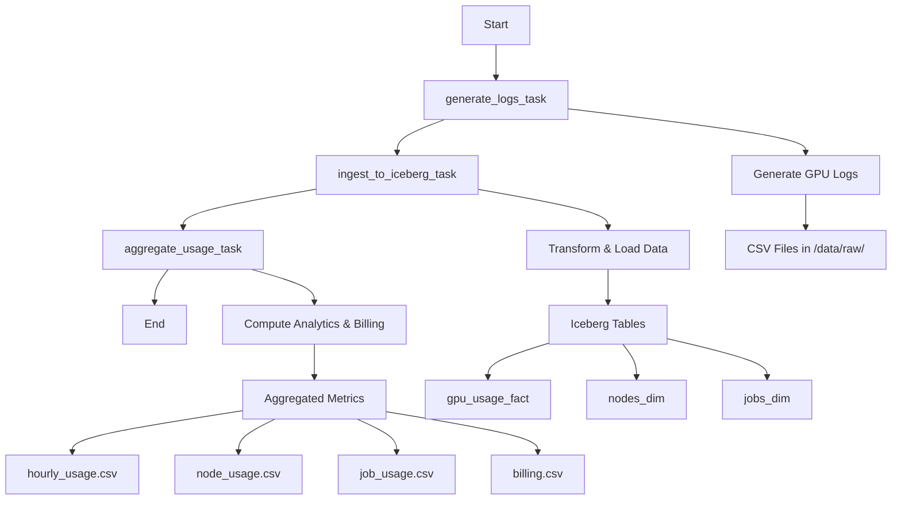

# DAG Overview

## Pipeline Architecture



## Task Details

### 1. generate_logs_task
- **Operator**: PythonOperator
- **Function**: `run_generate_logs()`
- **Purpose**: Generate realistic GPU usage data
- **Output**: CSV files in `/opt/airflow/data/raw/`
- **Schedule**: Every hour
- **Duration**: ~30 seconds

### 2. ingest_to_iceberg_task
- **Operator**: PythonOperator
- **Function**: `run_ingest_to_iceberg()`
- **Purpose**: Transform and load data into analytical tables
- **Dependencies**: generate_logs_task
- **Output**: Iceberg tables (mock CSV format)
- **Duration**: ~10-30 seconds

### 3. aggregate_usage_task
- **Operator**: PythonOperator
- **Function**: `run_aggregate_usage()`
- **Purpose**: Compute metrics and billing calculations
- **Dependencies**: ingest_to_iceberg_task
- **Output**: Aggregated CSV files and Iceberg tables
- **Duration**: ~5-15 seconds

## Data Flow

```
Raw GPU Logs (CSV)
       ↓
   Fact Table (gpu_usage_fact)
       ↓
   Dimension Tables (nodes_dim, jobs_dim)
       ↓
   Aggregated Metrics
       ↓
   Billing Calculations
       ↓
   Dashboard Visualization
```

## Error Handling

- **Retry Logic**: Default Airflow retry behavior
- **Failure Handling**: Tasks fail gracefully with logging
- **Data Validation**: Schema validation and data quality checks
- **Idempotency**: Safe to re-run without data duplication

## Monitoring

- **Success Metrics**: Task completion, record counts
- **Performance Metrics**: Execution time, throughput
- **Data Quality**: Schema validation, data completeness
- **Cost Tracking**: GPU hours, billing calculations

## Configuration

- **Schedule**: `@hourly` (every hour)
- **Start Date**: 2025-08-15
- **Catchup**: Disabled
- **Tags**: ["gpu", "billing"]
- **Owner**: airflow 